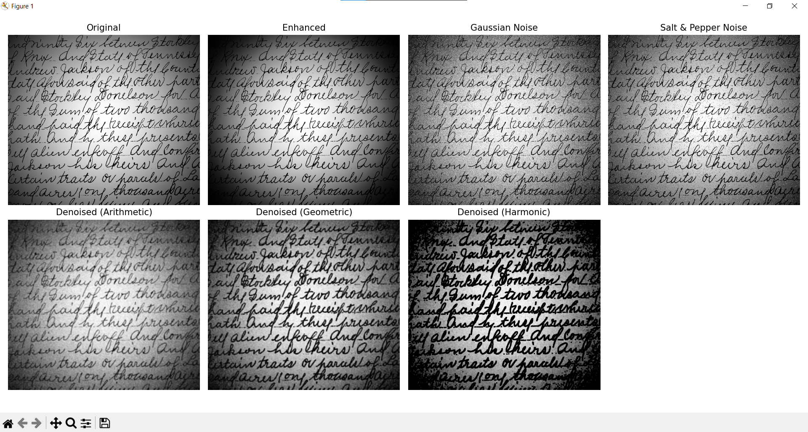
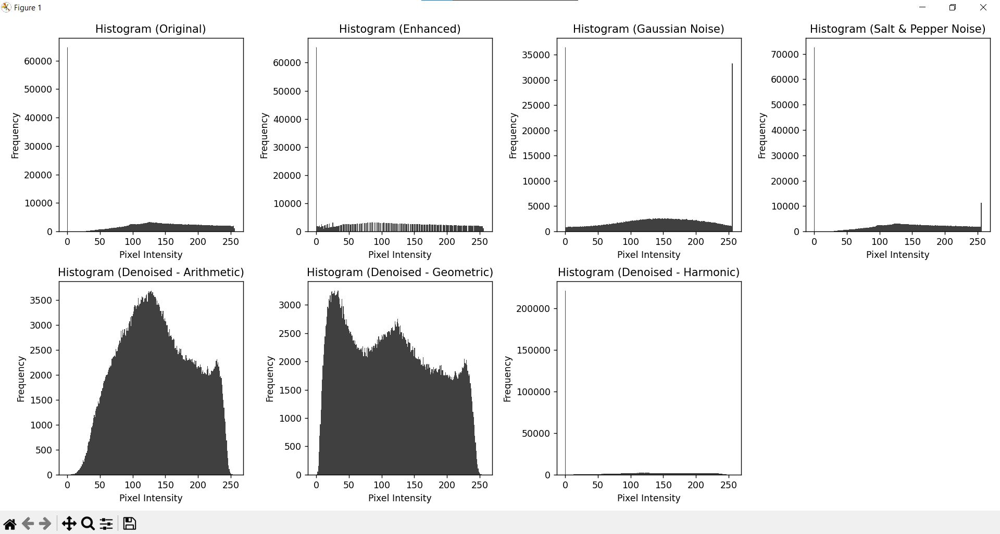

# Digital Image Processing - Exercise 1: Image enhance, Noise Addition & Removal


---

## 📌 Setup Guide

### 1️⃣ **Create a Virtual Environment**
Before running the project, create a virtual environment to manage dependencies:
```bash
python -m venv venv
```

Activate the virtual environment:
- **Windows**:
  ```bash
  venv\Scripts\activate
  ```
- **Mac/Linux**:
  ```bash
  source venv/bin/activate
  ```

---

### 2️⃣ **Install Dependencies**
Install all required Python packages using `requirements.txt`:
```bash
pip install -r requirements.txt
```

---

### 3️⃣ **Prepare Input Images**
Place your images inside the `images/` folder. There are 5 sample images in the `/images` folder

---

### 4️⃣ **Run the Script**
Run the Python script to process images:
```bash
python image_processing.py
```

---

### 5️⃣ **Output Files**
Processed images will be saved in the `processed_images/` folder.

Each image will have:
- `enhanced_<filename>.jpg` → Histogram Equalization applied.
- `noisy_<filename>.jpg` → Gaussian noise added.
- `arithmetic_filtered_<filename>.jpg` → Denoised with Arithmetic Mean Filter.
- `geometric_filtered_<filename>.jpg` → Denoised with Geometric Mean Filter.
- `gaussian_filtered_<filename>.jpg` → Denoised with Gaussian Filter.

---

## 🛠 Dependencies
All dependencies are installed automatically using `requirements.txt`.

---

## ⚡ Example Console Output
```bash
Processing Fig1045(a)(iceberg).tif - Original Resolution: 566x533 pixels
Processing Fig1049(a)(spot_shaded_text_image).tif - Original Resolution: 772x686 pixels
Processing Fig1053(a)(cygnusloop_Xray_original).tif - Original Resolution: 566x566 pixels
Processing Fig1061(LANDSAT_with moving target).tif - Original Resolution: 518x512 pixels
Processing FigP1036(blobs).tif - Original Resolution: 512x512 pixels
Processed images saved in processed_images
```

---

## ⚡ Example Visual Ouput


---
